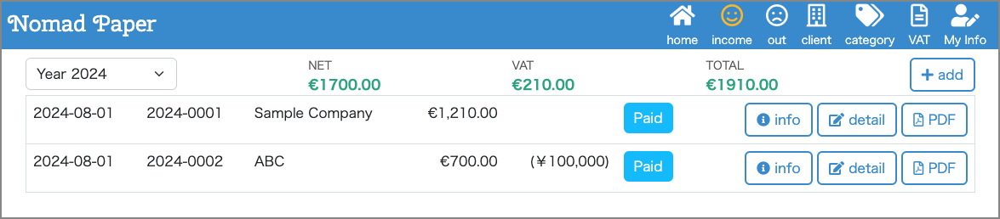
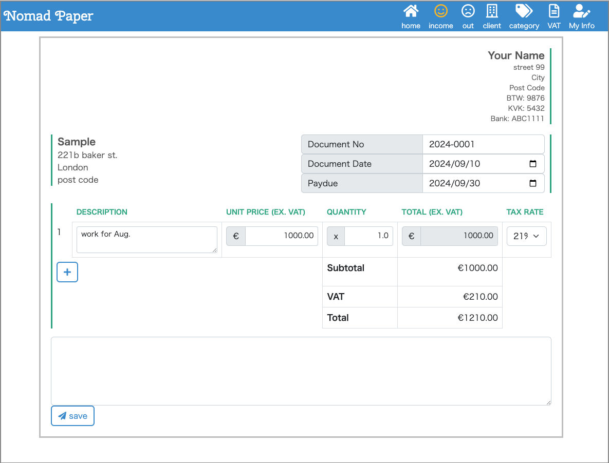
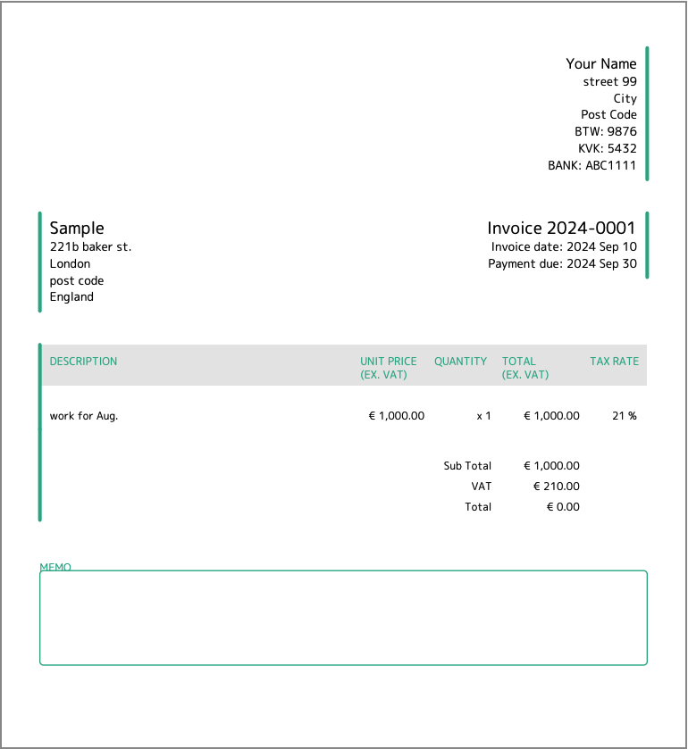
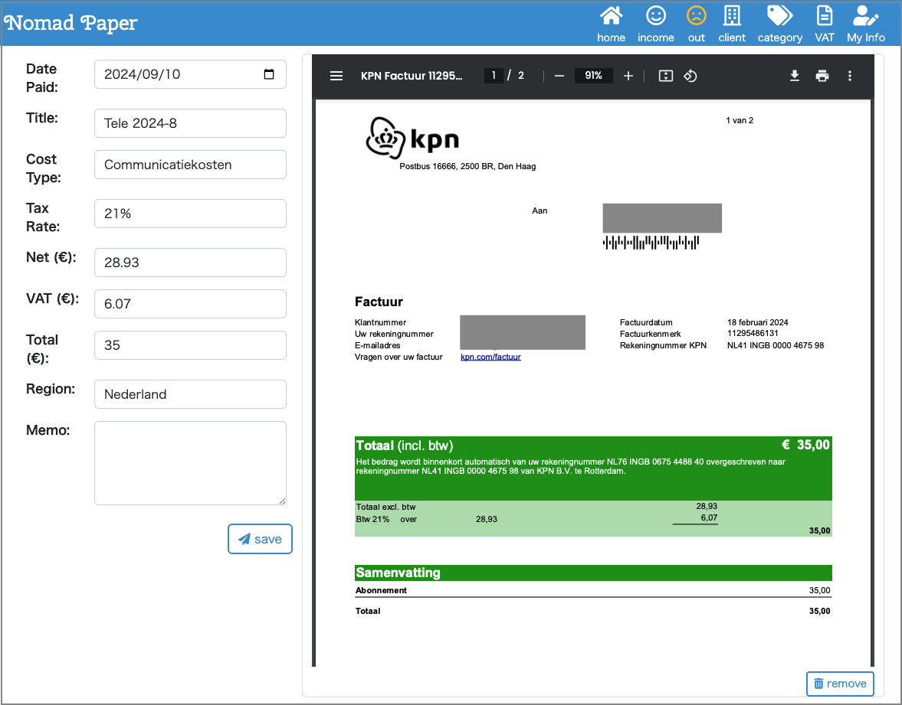
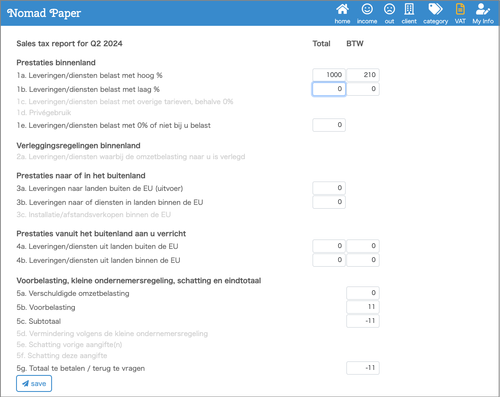

# Nomad Paper
Accounting software that automatically creates the Dutch VAT report "Aangifte Omzetbelasting" for self-employed individuals who receive work from within and outside the Netherlands


## What can do
* Create invoices
* Export invoices to PDF
* Record expenses
* Make VAT reports
* Corresponding to €, ¥, $ (you can add your currency)


## Screen Shots








## How to Start
```
$ git clone https://github.com/m-kanekawa/nomadpaper.git
$ docker-compose up -d
```

access localhost:8999/


## What prompted me to develop this software?

I'd been using [Gekko](https://www.getgekko.com/nl/) for years,
but I was not satisfied with the display of invoice for Japanese customers -- normally YEN is written as ¥10,000 but Gekko writes it like ¥10,000.00 --
